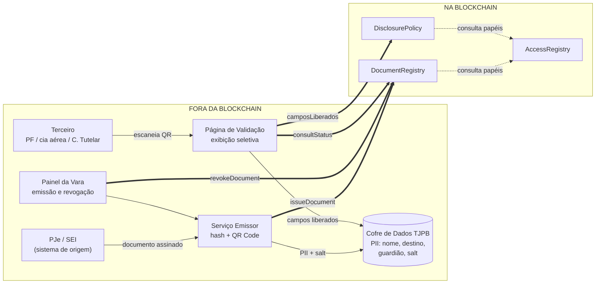

# Diagrama de Arquitetura — VerificaJus Sigilo

> Versão final. Começou como rascunho na Entrega 1 e mudou nas duas entregas
> seguintes — o histórico de commits deste arquivo mostra como. O que está
> abaixo é o sistema como ele efetivamente ficou: os três contratos, as duas
> telas do frontend e o cofre mock, todos já em código.

## Visão geral

A plataforma permite que terceiros — Polícia Federal, companhias aéreas, Conselho
Tutelar — confiram a autenticidade e a vigência de alvarás de viagem e termos de guarda
expedidos sob segredo de justiça, **sem qualquer acesso aos autos**.

O princípio que organiza a arquitetura: vai para a blockchain apenas aquilo que precisa
ser inegável e verificável por quem não confia no Tribunal. Tudo que identifica uma
criança fica fora dela.

As setas grossas são as que cruzam a fronteira: é exatamente aí que se decide o que a
rede vê e o que ela nunca verá.

## O que fica na blockchain

| Dado | Contrato | Por quê |
|---|---|---|
| Hash salgado do documento | `DocumentRegistry` | Prova de integridade sem revelar conteúdo |
| Hash da assinatura eletrônica | `DocumentRegistry` | Vincula o ato ao magistrado signatário |
| Tipo, órgão emissor, timestamps | `DocumentRegistry` | Conferir competência e vigência |
| Estado do ciclo de vida | `DocumentRegistry` | Impedir que revogado apareça como válido |
| Código do motivo da revogação | `DocumentRegistry` | Auditoria sem narrativa |
| Papéis institucionais | `AccessRegistry` | Definir quem emite e quem consulta |
| Campos divulgáveis por perfil | `DisclosurePolicy` | Tornar a política de sigilo auditável |
| Trilha de consultas | evento `ConsultaRegistrada` | Registro append-only de quem conferiu |

## O que fica fora da blockchain

Nome da criança ou adolescente, nome do guardião ou acompanhante, destino da viagem,
número do processo, peças processuais, e o `salt` do hash. Tudo isso permanece no cofre
do TJPB e só é exibido na página de validação, campo a campo, conforme a política que o
`DisclosurePolicy` publica.

## Fluxo de validação

1. O terceiro escaneia o QR Code impresso no documento. O QR carrega apenas o `docId`
   opaco — não leva a lugar nenhum dentro do processo.
2. A página de validação chama `consultStatus(docId)` e obtém `Valido`, `Expirado`,
   `Revogado`, `Substituido` ou `Inexistente`.
3. A página chama `camposLiberados(tipo, papel)` para saber o que o perfil daquele
   consulente pode ver.
4. Só então busca no cofre os valores desses campos — e apenas deles.
5. `registrarConsulta(docId)` emite o evento que compõe a trilha de auditoria.

A vara não é contatada em nenhum momento. É esse o ganho operacional.

## Três decisões de projeto

**O hash é salgado.** `contentHash = keccak256(documento ‖ salt)`, com o salt no cofre.
Um alvará de viagem é um documento de baixa entropia: modelo fixo, poucos destinos
plausíveis, faixa estreita de datas. Um hash não-salgado permitiria a qualquer leitor da
rede testar hipóteses até casar o hash e descobrir o conteúdo. O salt custa nada e fecha
o vazamento.

**O motivo da revogação é código, não texto livre.** `bytes32 reasonCode`, resolvido
para texto fora da cadeia. Gravar *"revogado por suspeita de subtração de incapaz"* em
ledger imutável violaria exatamente o segredo de justiça que o sistema existe para
proteger — e seria irreversível.

**`Expirado` é derivado na leitura, nunca armazenado.** Persistir a expiração exigiria
alguém pagando gas para virar o estado de cada documento no seu vencimento. Esse alguém
não existe, e enquanto ele não passa o documento vencido continua se declarando válido.
`consultStatus` compara `expiresAt` com `block.timestamp` e responde a verdade sempre.

## Rede

A proposta do Núcleo Jurídico indica **blockchain permissionada**, pela natureza sigilosa
dos processos da infância e juventude. O protótipo foi implantado e demonstrado na rede
Besu da disciplina (`bc101-dev-env`, permissionada via QBFT), com Hardhat Network para
desenvolvimento local e a configuração de Sepolia já pronta em `hardhat.config.ts` caso
se queira demonstrar em rede pública.

Nada no código depende de rede permissionada: o modelo de privacidade não pressupõe que
a cadeia seja privada. Hash salgado, motivo codificado e ausência de PII fazem os
registros serem seguros mesmo em rede pública. A rede permissionada é defesa em
profundidade, não a defesa principal.

## Onde cada peça mora no código

| Componente do diagrama | Arquivo |
|---|---|
| Painel da Vara | `frontend/admin.html` + `frontend/admin.js` |
| Serviço Emissor (hash + QR Code) | `frontend/admin.js` (gera o hash salgado e o QR ao emitir) |
| Cofre de Dados TJPB | `frontend/cofre.mock.js` — mock em localStorage, não o cofre definitivo |
| Página de Validação | `frontend/validar.html` + `frontend/validar.js` |
| Código comum (rede, contratos, campos) | `frontend/shared.js` |

## Limitações conhecidas

Esta é uma prova de conceito acadêmica, não um sistema pronto para produção. O que ela
não resolve, deliberadamente:

- **Cofre de PII.** `frontend/cofre.mock.js` é `localStorage` do navegador, não um
  serviço com controle de acesso próprio. Em produção seria uma API do TJPB, com sua
  própria autenticação e auditoria — nada no modelo de contratos muda para isso
  acontecer, mas o serviço em si não foi construído.
- **Integração com PJe/SEI.** O painel da vara (`admin.html`) simula a emissão; não há
  integração real com o sistema processual de origem, que dispararia o registro
  automaticamente na assinatura do magistrado.
- **Autenticação dos consulentes externos.** A tela de validação deixa o usuário
  escolher o próprio perfil (Polícia Federal, cia aérea, Conselho Tutelar) num `select`.
  Em produção isso exigiria autenticação real da instituição consulente — hoje é
  possível qualquer um se declarar qualquer perfil.
- **Gestão de chaves.** As transações de emissão e revogação são assinadas com chaves
  de teste públicas embutidas no frontend (ver `frontend/shared.js`), aceitável só em
  rede de desenvolvimento descartável. Um TJPB real precisaria de custódia de chave
  adequada para a vara emissora.
- **Validações e casos de borda.** Os contratos não verificam, por exemplo, se um
  `docId` já existe antes de `issueDocument` sobrescrever, nem impedem revogar um
  documento inexistente. A suíte de testes cobre o caminho central e o controle de
  acesso — não exaustão de casos de borda.

O que o modelo *garante*, mesmo com essas lacunas: nenhum dado que identifique a
criança, o adolescente ou a família chega à blockchain em nenhum ponto do fluxo — isso
é verificável lendo os três contratos, não é uma promessa da interface.