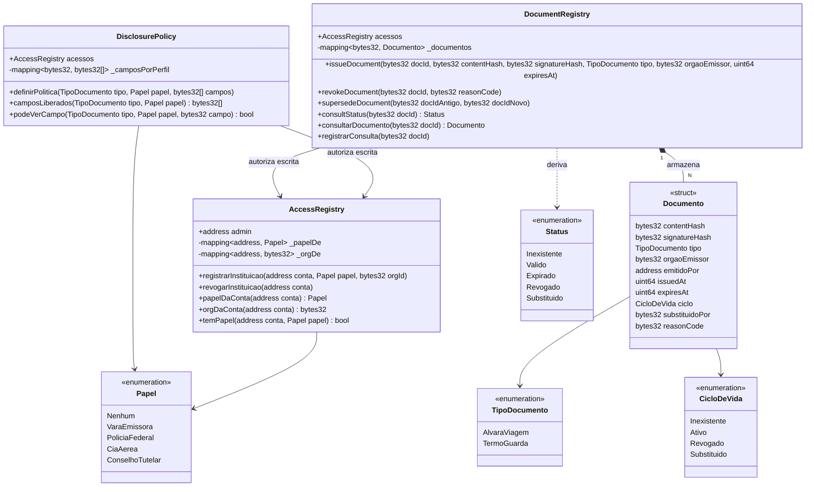

# Diagrama de Classes dos Contratos — VerificaJus Sigilo

> Versão final. A superfície dos três contratos não mudou desde a Entrega 1 — o que
> mudou foi tudo em volta deles (frontend completo, cofre mock, política de divulgação
> em uso real). Ver `git log --follow docs/contratos.md` para o histórico.

Três contratos. `AccessRegistry` é a única fonte de identidade; os outros dois leem dele
e não guardam endereços próprios.



## Eventos

| Contrato | Evento |
|---|---|
| `AccessRegistry` | `InstituicaoRegistrada(address, Papel, bytes32)` |
| `AccessRegistry` | `InstituicaoRevogada(address)` |
| `DisclosurePolicy` | `PoliticaDefinida(TipoDocumento, Papel, uint256)` |
| `DocumentRegistry` | `DocumentoEmitido(bytes32, TipoDocumento, bytes32, uint64)` |
| `DocumentRegistry` | `DocumentoRevogado(bytes32, bytes32, uint64)` |
| `DocumentRegistry` | `DocumentoSubstituido(bytes32, bytes32, uint64)` |
| `DocumentRegistry` | `ConsultaRegistrada(bytes32, bytes32, uint64)` |

## `CicloDeVida` versus `Status`

A assimetria entre os dois enums é intencional e é o ponto mais importante do modelo.

`CicloDeVida` tem quatro valores e é **persistido**. `Status` tem cinco e é
**retornado**. A diferença é `Expirado`, que não existe como estado gravado:
`consultStatus` lê o ciclo e, se ele for `Ativo` e `block.timestamp > expiresAt`,
responde `Expirado`.

Revogação e substituição têm precedência sobre expiração. Um alvará revogado que também
venceu reporta `Revogado` — é esse o fato que importa a quem confere o documento no
balcão.

## Fluxo central

```
issueDocument → camposLiberados (por perfil) → consultStatus → revokeDocument → consultStatus
```

Uma conta autorizada da vara registra o documento (`admin.html`). Um terceiro escaneia o
QR Code, a tela de validação (`validar.html`) consulta `DisclosurePolicy.camposLiberados`
para saber o que aquele perfil pode ver, busca só esses campos no cofre, e mostra
`consultStatus` como `Valido`. A vara revoga por decisão judicial; a leitura seguinte do
mesmo terceiro retorna `Revogado`. Nenhuma das partes acessou os autos em nenhum momento.
Coberto por `test/DocumentRegistry.test.ts`, `test/DisclosurePolicy.test.ts` e
`test/AccessRegistry.test.ts`.

## Convenção de nomes

Substantivos de domínio em português: `Papel`, `TipoDocumento`, `CicloDeVida`,
`camposLiberados`, `orgaoEmissor`. *Alvará*, *vara* e *termo de guarda* são termos
técnicos jurídicos que perdem precisão traduzidos, e o Núcleo Jurídico precisa reconhecer
o vocabulário no código.

Verbos genéricos de ciclo de vida em inglês: `issueDocument`, `revokeDocument`,
`supersedeDocument`, `consultStatus`. Não carregam carga jurídica e seguem a convenção
de Solidity.

## Estado final

Os contratos implementam **toda** a superfície descrita acima, e o diagrama corresponde
ao código linha por linha — nenhuma função descrita aqui é hipotética. O frontend
(`admin.html` + `validar.html`) usa as três interfaces de ponta a ponta contra contrato
real, não mock.

A suíte de testes é deliberadamente enxuta: cobre o caminho central e o controle de
acesso de cada contrato, não exaustão de casos de borda. Ver
[Limitações conhecidas](arquitetura.md#limitações-conhecidas) para o que fica
explicitamente fora — validação de `docId` duplicado, autenticação real do consulente e
gestão de chave de produção não estão cobertos, por decisão de escopo desde o início do
projeto.